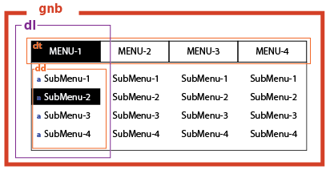
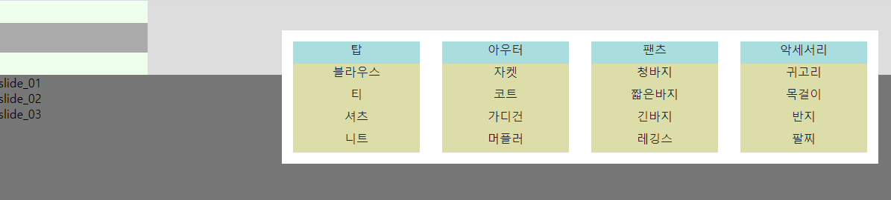
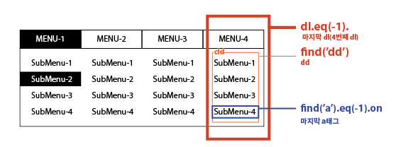

# 웹디자인기능사

## 1. 기본세팅

### - 폴더생성

(폴더)img > 이미지

(폴더)css > main.css

(폴더)js > main.js

​		  	>jquery-3.4.1.min.js (기본 제공파일)

index.html


### - html 준비


html 기본세팅
    
```html
<!DOCTYPE html>
<html lang="ko-KR">
<head>
  <meta charset="UTF-8">
  <link rel="stylesheet" href="./css/main.css">
  <title>웹디자인기능사</title>
</head>
<body>
    <script src="./js/jquery-3.4.1.min.js"></script>
    <script src="./js/main.js"></script>
</body>
</html>
```


### - css 준비

css기본세팅
​reset.css 세팅 (모든 항목 세팅 초기화)

```css
@charset "UTF-8";

html,body{width:100%; height:100%; font-family: sans-serif;background-color:#fff;} 
/* 시험지 컬러가이드에 나와있는 배경색 */
*{margin:0; padding:0; border:0; outline:0; list-style:none;}
a{display:block; width:100%; height:100%; text-decoration:none;color:#222328}
p{color:#222328}
/* 시험지 컬러가이드에 나와있는 글자색 */
.hidden{display:none;}
header,article,section,nav,footer{display:block;}
*:focus{border:1px solid #f00; box-sizing:border-box;}
/* ===================== */
```

### -  js준비

jQuert 대소문자 주의

과정

​	①	()();

​	②	()(jQuery);

​	③	(function($){})(jQuery);

```js
(function($){
	console.log('연결확인'); // console창에 '연결확인'문구가 뜨는지 확인 후 삭제
})(jQuery);
```


## 2.영역만들기

### - html

header, section, article, footer,nav는 익스플로러가 인식을 못하기 때문에 css에서{display:block} 써주기.

모르겠으면 전부 div써도 무관함.

```html
<div id="wrap">
    <header id="headBox"></header>
    <section id="viewBox"></section>
    <article id = "conBox"></article>
    <footer id="footBox"></footer>
</div>
```


### - css

background-color는 확인용(나중에 지우기)

```css
#wrap{width: 1200px; height:auto; margin:auto; background-color:#f00;} 
/*
가운데정렬 - margin:auto;
왼쪽정렬 - float:left;(안쓰면 왼쪽정렬)
오른쪽정렬 - float:right;
*/
#headBox{width: 100%; height:100px;background-color:#777;}
#viewBox{width:100%; height:300px;background-color:#aaa;}
#conBox{width:100%; height:200px;background-color:#555;}
#footBox{width:100%; height:100px;background-color:#ccc;}
```


## 3. 세부 영역만들기

## - html

각 영역별로 큰 상자만 만들기

```html
<div id="wrap">
    <header id="headBox">
      <h1><a href="#"><span class="hidden">Just 쇼핑몰</span></a></h1>
      <nav id="gnb"></nav>
    </header>

    <section id="viewBox">
      <div class="slide">
        <div class="slide_01">slide_01</div>
        <div class="slide_02">slide_02</div>
        <div class="slide_03">slide_03</div>
      </div>
    </section>

    <article id = "conBox">
      <div class="con01"></div>
      <div class="con02"></div>
      <div class="con03"></div>
    </article>

    <footer id="footBox">
      <h2><span class="hidden">Just 쇼핑몰</span></h2>
      <address>copyright 제공되는 문구</address>
      <div class="sns"></div>
    </footer>
</div>
```

## - css

```css
#headBox{width: 100%; height:100px;background-color:#efe;}
  h1{float:left;width: 200px; height: 40px; margin-top:30px; background-color: #aaa;}
  #gnb{float:right;width: 1000px; height: 100%; background-color: #ddd;}

/* ==================== */
#viewBox{width:100%; height:300px;background-color:#eef;overflow:hidden;}
/* div가 가로로 길게 나오는 것 확인 후 #viewBox에  overflow:hidden;*/
  .slide{width: 300%; height: 100%;  background-color: #777;}
  .slide>div{float:left; width: 1200px; height: 100%; background-color: #add;}
/* ==================== */
#conBox{width:100%; height:200px;background-color:#ffd;}
  .con01{float:left; width: 500px; height: 100%; background-color: #555;}
  .con02{float:left; width: 400px; height: 100%; background-color: #aaa;}
  .con03{float:left; width: 300px; height: 100%; background-color: #333;}

/* ==================== */
#footBox{width:100%; height:100px;background-color:#dff;}
  h2{float:left;width: 200px; height: 40px; margin-top:30px; background-color: #aaa;}
  address{float:left; width: 800px;height: 100%; text-align: center; line-height: 100px; color:#222328; background-color: #444;}
  .sns{float:left; width: 200px; height: 100%; background-color: #aaa;}
```


## 4. 영역별로 만들기

### ● header#headBox

####  	-gnb html


```html
<!-- dl>(dt>a[href="#"]^dd>ul>(li>a[href="#"])*4)*4 -->
        <dl>
          <dt><a href="#"></a></dt>
          <dd>
            <ul>
              <li><a href="#"></a></li>
              <li><a href="#"></a></li>
              <li><a href="#"></a></li>
              <li><a href="#"></a></li>
            </ul>
          </dd>
          <dt><a href="#"></a></dt>
          <dd>
            <ul>
              <li><a href="#"></a></li>
              <li><a href="#"></a></li>
              <li><a href="#"></a></li>
              <li><a href="#"></a></li>
            </ul>
          </dd>
          <dt><a href="#"></a></dt>
          <dd>
            <ul>
              <li><a href="#"></a></li>
              <li><a href="#"></a></li>
              <li><a href="#"></a></li>
              <li><a href="#"></a></li>
            </ul>
          </dd>
          <dt><a href="#"></a></dt>
          <dd>
            <ul>
              <li><a href="#"></a></li>
              <li><a href="#"></a></li>
              <li><a href="#"></a></li>
              <li><a href="#"></a></li>
            </ul>
          </dd>
        </dl>
```


#### 	-gnb css

*	메뉴가 앞으로 나와야하기 때문에 position:relative; z-index:1;를 써분다

```css
#headBox{position:relative; z-index:1; width: 100%; height:100px;background-color:#efe;}
#gnb{float:right;width: 1000px; height: 100%; padding:40px 0 0 180px; box-sizing: border-box; background-color: #ddd;}
  #gnb>dl{float:left; width: 200px; height: auto; padding:15px; box-sizing: border-box; background-color: #fff;text-align:center;}
  #gnb>dl>dt{width: auto; height: 30px; background-color: #add;}
  #gnb>dl>dd{width: auto; height: auto;}
/* 사진처럼 나오는 것 확인 후 #gnb>dl>dd에  display:none;*/
  #gnb>dl>dd>ul{width: auto; height: auto;}
  #gnb>dl>dd>ul>li{width: auto; height: 30px; background-color: #dda;}
```

- gnb float:right - 전체적으로 오른쪽으로, padding로 위치를 맞춰줌.
- gnb - width : 1000px / dl - width: 800px 이므로 padding-left를 180px로 왼쪽에서 180px만큼 떨어뜨리기




#### -gnb js

주의사항

* $()내부 ' ' / " "로 감싸기 (아무거나 상관없음)
* $('#gnb') 지정항목의 id, class에 따라 # . 확인하기
* focus와 blur는 'a'에 지정되어야만 작동함. 마우스는 dt,dd,dl,div 모두 작동함.
```javascript
  //gnb 만들기
	var gnb = $('#gnb');
    var gnbDl = gnb.find('dl');
    var gnbDt = gnbDl.children('dt');
	var gnbDd = gnbDl.children('dd');

    gnbDt.children('a').on('mouseenter focus',function(){
      gnbDd.stop().slideDown();
     });
    gnb.on('mouseleave',function(){
      gnbDd.stop().slideUp();
     });
```




### ● section#viewBox

#### -slide html
* html에서 img태그로 이미지 추가(alt에 적절한 이미지 이름 반드시! 써야함)

* css에서 background-image로 이미지추가 ( 이 경우 alt에 들어가야하는 이미지 설명을 따로 써야함 span class="hidden")

* 포토샵에서 이미지 편집시 사이즈에 맞게 편집하는게 편함. (1200px * 300px) - 시험지에 나온대로

* 이미지 확장자, 경로 확인


```html
    <section id="viewBox">
      <div class="slide">
        <div class="img_01"></div>    
        <div class="img_02"></div>    
        <div class="img_03"></div>    
      </div>
    </section>
```
#### -slide css
* slide의 position을 이용해 옆으로 이동해야하므로 position: relative; z-index: 0; 추가

```css
.slide{position: relative; z-index: 0; width: 300%; height: 100%;  background-color: #777;}
```
#### -slide js

* setInterval 로 반복 (대소문자 주의 ) i 대문자
* 2000(2초) 속도조절 / 3초이내로 바꿔도 무관 0(0초)~3000(3초)

```javascript
   var viewBox = $('#viewBox');
   var slide = viewBox.children('.slide');
   var simg = slide.children('div');

   setInterval(function(){
      slide.animate({left:-100+'%'},function(){
           $(this).find('div').eq(0).appendTo(slide);
           $(this).css({left:0});
      });
   },2000);
```